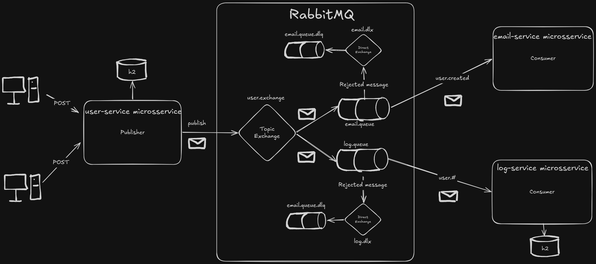

# PidgeyMail

PidgeyMail is a modular Spring Boot application built around event-driven communication with RabbitMQ. It is organized as a small distributed system with separate services for user registration, welcome email delivery, and audit logging.

The project demonstrates how to split a backend into focused services that communicate through asynchronous messages instead of tight direct dependencies. The user service handles registration, persists users, and publishes a `UserCreatedEvent`. The email service listens for that event and sends a welcome email. The log service also listens for the same event and stores an audit trail.

## Architecture diagram

## Services

### User Service

The user service exposes the registration endpoint and manages the core user workflow. It validates email uniqueness, hashes passwords, persists the user, and publishes a creation event to RabbitMQ after a successful registration.

### Email Service

The email service consumes user-creation events and sends a welcome email using a Thymeleaf template and SMTP integration. It is responsible only for email delivery and keeps that concern isolated from the registration flow.

### Log Service

The log service listens to the same user-creation event and stores audit information, including the user ID, routing key, and event timestamp. This gives the system a separate persistence layer for operational tracking and traceability.

## Main flow

1. A client submits a registration request to the user service.
2. The user service validates the payload and saves the user.
3. The user service publishes a `UserCreatedEvent` to RabbitMQ.
4. The email service consumes the event and sends a welcome message.
5. The log service consumes the event and stores an audit record.

## Tech stack

- Java 21
- Spring Boot
- Spring Web MVC
- Spring Security
- Spring Data JPA
- Spring AMQP / RabbitMQ
- Thymeleaf
- Spring Mail
- H2
- Flyway

## Purpose

This project is useful as a reference for event-driven backend design, service separation, and message-based integration between independent Spring Boot services.
